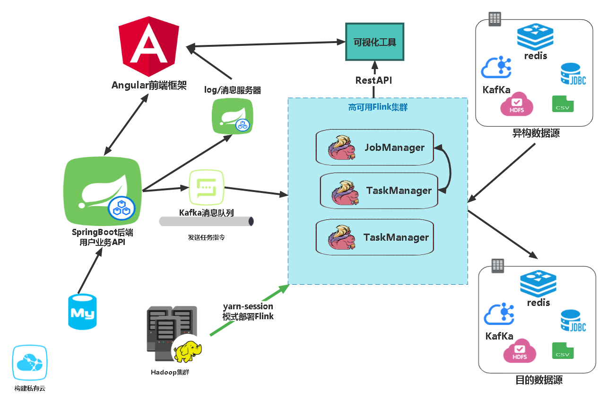

# SmartBase

#### 介绍
基于flink-hdfs的异构数据处理平台。支持，mysql,redis,kafka,hdfs,hbase等消息存储系统的多源异构数据转换，同时支持生成CSV，TXT等格式的处理结果。提供低代码的前端交互界面，用户通过配置方式上传任务至集群，任务结果通过平台可以可视化查看。

#### 软件架构
项目通过linux集群运行。
- 任务处理架构为flink-yarn集群，通过yarn-session运行任务，slot可以按需使用，提高集群的资源利用率。同时配置高可用，Job-Manager可以与task-manager宕机时自动转换。
- web项目交互搭建在Springboot框架上，使用kafka负载均衡集群作为任务上传与结果的消息队列。
- logs返回至消息服务器（springboot），传回至前端。
    - [springboot链接](https://gitee.com/StarGrys/smart-base)
- 前端使用Angular框架。
    - [前端链接](https://gitee.com/det0cte/smart-base-web-dashborad)




#### 集群配置
-  **环境说明** ： 以下为项目运行所需环境，按以下配置不会出现版本兼容性问题。
    - 集群：Linux-CentOS-3.10.0-862.el7.x86_64 * 3
    - gcc： 4.8.5 20150623 (Red Hat 4.8.5-44) (GCC) 
    - java：1.8.0_212
    - redis：6.2.1
    - kafka：2.13-3.1.0
    - hadoop：3.1.3
    - flink：1.13.2
    - zookeeper: 3.5.7
    
-  **模块配置** 
    1.  Linux，gcc，java 请自行百度
    2.  [redis文档](docs/redis.md)
    3.  [kafka文档](docs/kafka.md)
    4.  [flink文档](docs/flink.md)
    5.  [mysql文档](docs/mysql.md)


#### 功能概要
-  **目前支持的功能有**
    - restful传参执行任务
    - 可视化界面（部分）- 增删查任务，动态加载，用户上传，页面编辑
    - kafka->json
    - kafka->mysql
    - mysql->Java Class
    - mysql->kafka
    - mysql->localhost,hdfs(txt/csv) 
    - 多mysql源->mysql 聚合同步
    - redis->localhost,hdfs(txt/csv)

- **待实现的功能有**
    - 端口自定义数据源插入任意数据源
    - redis聚合输出
    - Hbase支持
    - 仪表盘


#### 使用说明
1.  flink启动说明：
    - 首先启动hdfs-yarn集群

```
  cd /home/star/bin
  ./myhadoop start
```

- Yarn模式启动flink集群-session模式——详细配置见：[flink文档](docs/flink.md)

- ```
  ./yarn-session.sh -nm test -d
  ```


#### 开发者说明
-  **模块配置** 
    1.  [Flink内部传参文档](docs/Parameter.md)
    1.  [ApiFox请求接口文档](docs/interfaceTest.md)


#### 参与贡献

1. 贡献代码
2. 软件功能测试
3. 请我吃薯片
4. 关注**嘉然今天吃什么（bushi！）**


#### 特技

1.  老麻抄手吃20个加豆皮加卤蛋
2.  晚上不睡早上不起
3.  英雄联盟艾欧尼亚铂金
4.  桥牌七无将大师(把把硬叫7NT)