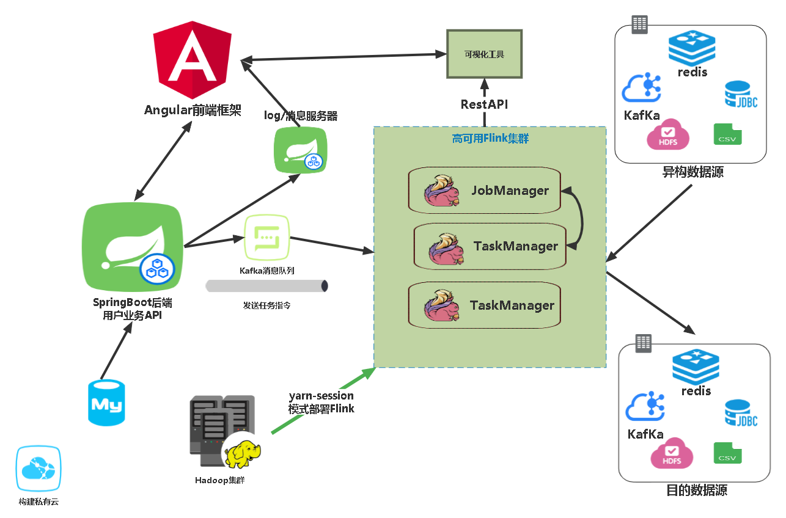

# SmartBase

#### 介绍
基于flink-hdfs的异构数据处理平台。支持，mysql,redis,kafka,hdfs,hbase等消息存储系统的多源异构数据转换，同时支持生成CSV，TXT等格式的处理结果。提供低代码的前端交互界面，用户通过配置方式上传任务至集群，任务结果通过平台可以可视化查看。

#### 软件架构
项目通过linux集群运行。
- 任务处理架构为flink-yarn集群，通过yarn-session运行任务，slot可以按需使用，提高集群的资源利用率。同时配置高可用，Job-Manager可以与task-manager宕机时自动转换。
- web项目交互搭建在Springboot框架上，使用kafka负载均衡集群作为任务上传与结果的消息队列。
- logs返回至消息服务器（springboot），传回至前端。
- 前端使用Angular框架。




#### 集群配置
-  **环境说明** ： 以下为项目运行所需环境，按以下配置不会出现版本兼容性问题。
    - 集群：Linux-CentOS-3.10.0-862.el7.x86_64 * 3
    - gcc： 4.8.5 20150623 (Red Hat 4.8.5-44) (GCC) 
    - java：1.8.0_212
    - redis：6.2.1
    - kafka：2.13-3.1.0
    - hadoop：3.1.3
    - flink：1.13.2
    - zookeeper: 3.5.7
    
-  **模块配置** ：
1.  Linux，gcc，java 请自行百度
2.  [redis文档](docs/redis.md)
3.  [kafka文档](docs/kafka.md)
4.  [flink文档](docs/flink.md)


#### 使用说明
1.  flink启动说明：
    - 首先启动hdfs-yarn集群

```
  cd /home/star/bin
  ./myhadoop start
```

- Yarn模式启动flink集群-session模式——详细配置见：[flink文档](docs/flink.md)

- ```
  ./yarn-session.sh -nm test -d
  ```


2.  xxxx
3.  xxxx

#### 参与贡献

1.  Fork 本仓库
2.  新建 Feat_xxx 分支
3.  提交代码
4.  新建 Pull Request


#### 特技

1.  使用 Readme\_XXX.md 来支持不同的语言，例如 Readme\_en.md, Readme\_zh.md
2.  Gitee 官方博客 [blog.gitee.com](https://blog.gitee.com)
3.  你可以 [https://gitee.com/explore](https://gitee.com/explore) 这个地址来了解 Gitee 上的优秀开源项目
4.  [GVP](https://gitee.com/gvp) 全称是 Gitee 最有价值开源项目，是综合评定出的优秀开源项目
5.  Gitee 官方提供的使用手册 [https://gitee.com/help](https://gitee.com/help)
6.  Gitee 封面人物是一档用来展示 Gitee 会员风采的栏目 [https://gitee.com/gitee-stars/](https://gitee.com/gitee-stars/)
