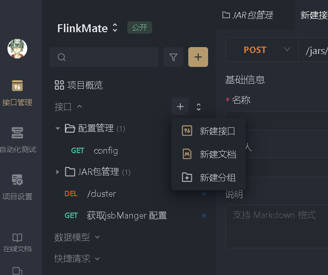
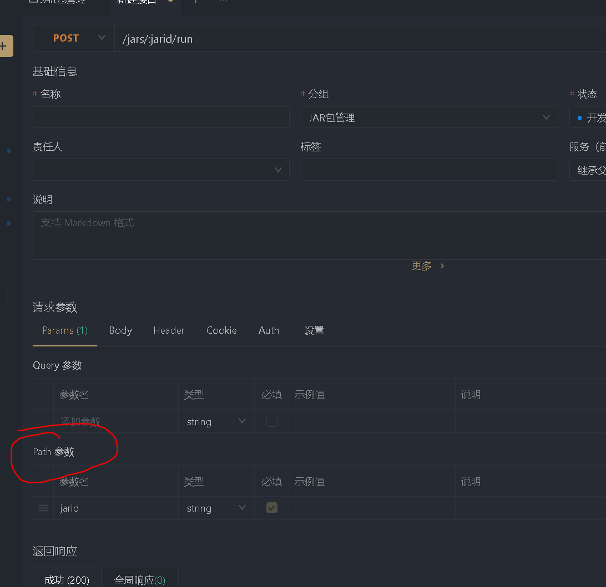
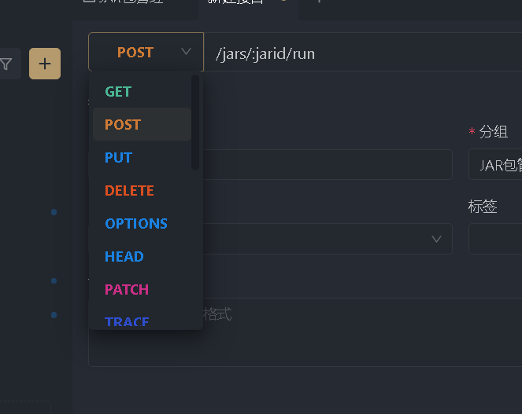
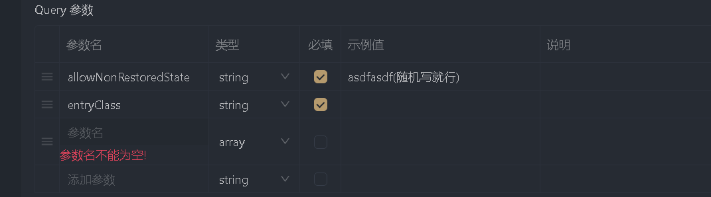

# 测试用例

下载apifox软件 


阅读[REST API | Apache Flink](https://nightlies.apache.org/flink/flink-docs-release-1.14/zh/docs/ops/rest_api/#cluster)

按照用例编写接口请求 可以先按照类型随便写

因为都是REST API 所以只设置好Params 就可以了

不需要进行请求

注意

-  在这里加入新接口
  - 

-  在url中有：** 的格式 如**/jars/:jarid/run **这里的：jarid 需要在下方的path中设定
  - 
-  注意请求的类型（在文档中给有标注）
  - 

- 对于怎么写请求

- 以这个为例

- ```
  {
    "type" : "object",
    "id" : "urn:jsonschema:org:apache:flink:runtime:webmonitor:handlers:JarRunRequestBody",
    "properties" : {
      "allowNonRestoredState" : {
        "type" : "boolean"
      },
      "entryClass" : {
        "type" : "string"
      },
      "jobId" : {
        "type" : "any"
      },
      "parallelism" : {
        "type" : "integer"
      },
      "programArgs" : {
        "type" : "string"
      },
      "programArgsList" : {
        "type" : "array",
        "items" : {
          "type" : "string"
        }
      },
      "savepointPath" : {
        "type" : "string"
      }
    }
  }            
       
  ```



一般是从properties开始的，挨个找参数 可能有数组情况 设定好类型就好